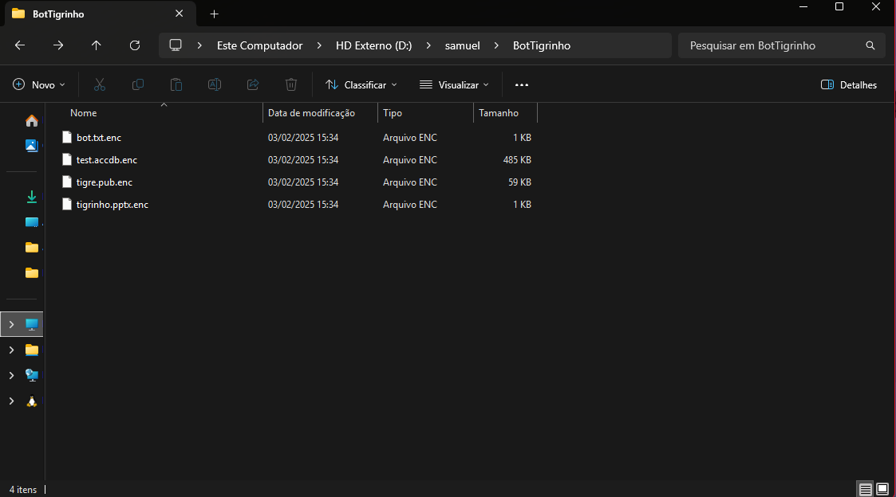
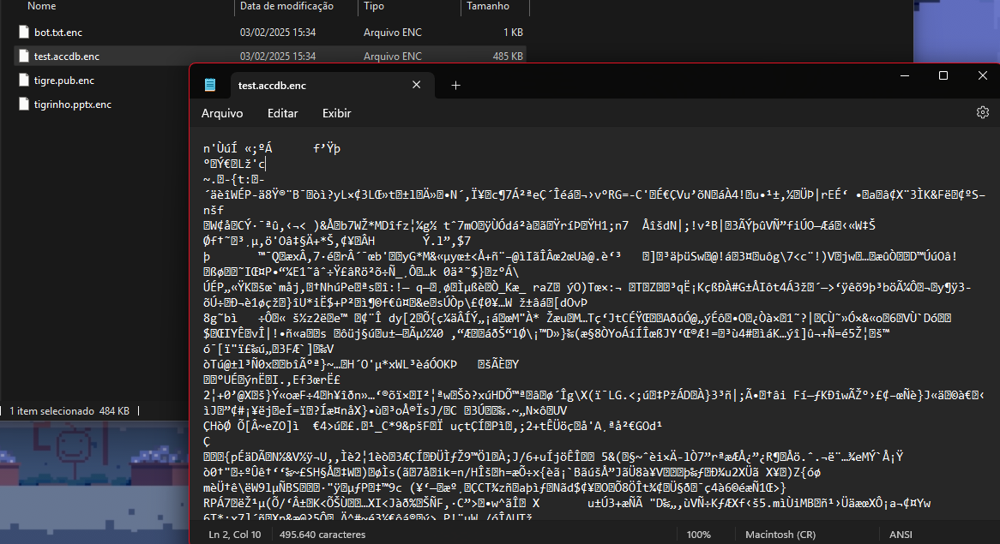
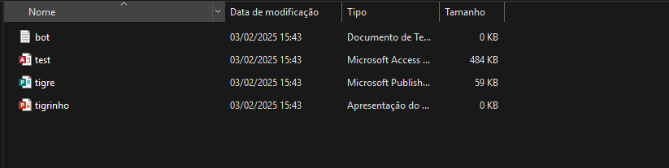
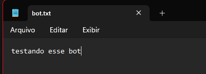

## Explicação das Melhorias

📌 Agora o código funciona no Windows e Linux:

No Windows, ele oculta o diretório para impedir acesso.
No Linux, ele remove permissões (chmod 0000).
📌 Evita criptografar arquivos já criptografados:

O código agora verifica se um arquivo já possui a extensão .enc.
📌 Usa uma senha personalizada:

O usuário agora pode digitar a senha no terminal ao rodar o programa.
A senha é convertida em chave criptográfica usando argon2.
📌 Remove os arquivos originais após a criptografia:

Antes, os arquivos criptografados eram apenas criados como cópias, deixando os originais visíveis. Agora, eles são deletados após a criptografia.
O mesmo acontece na descriptografia, restaurando os arquivos originais e removendo os criptografados.
📌 Melhora a interface de linha de comando:

Agora exibe mensagens informando quais arquivos estão sendo criptografados/descriptografados.

## Como Usar
1️⃣ Criptografar e bloquear uma pasta
```
go run main.go encrypt "C:\Users\usuario\meus_arquivos"
```
ou 
```
go run main.go encrypt /home/usuario/meus_arquivos
```
2️⃣ Descriptografar e desbloquear uma pasta

```
go run main.go decrypt "C:\Users\usuario\meus_arquivos"
```
ou 
```
go run main.go decrypt /home/samuel/meus_arquivos
```
Esse código agora protege os arquivos de forma eficiente e pode ser usado no Windows e Linux

## Exemplo para criptografado e trancado
PS D:\samuel\ALL\TUDO EM GOLANG\Criptografia> go run main.go crypto.go encrypt D:\samuel\BotTigrinho
Digite a senha: s@ltForExtraSecurity!
Diretório criptografado e trancado com sucesso!




## Exemplo para descriptografia e destrancado
PS D:\samuel\ALL\TUDO EM GOLANG\Criptografia> go run main.go crypto.go decrypt  D:\samuel\BotTigrinho
Digite a senha: s@ltForExtraSecurity!
Diretório descriptografado e destrancado com sucesso!




## Modifique o func generateKey para colocar a senha que queria
````
// Gera uma chave segura a partir da senha do usuário
func generateKey(password string) []byte {
	salt := []byte("s@ltForExtraSecurity!") // Pode ser salvo ou gerado dinamicamente
	return argon2.IDKey([]byte(password), salt, 1, 64*1024, 4, 32)
}
````

